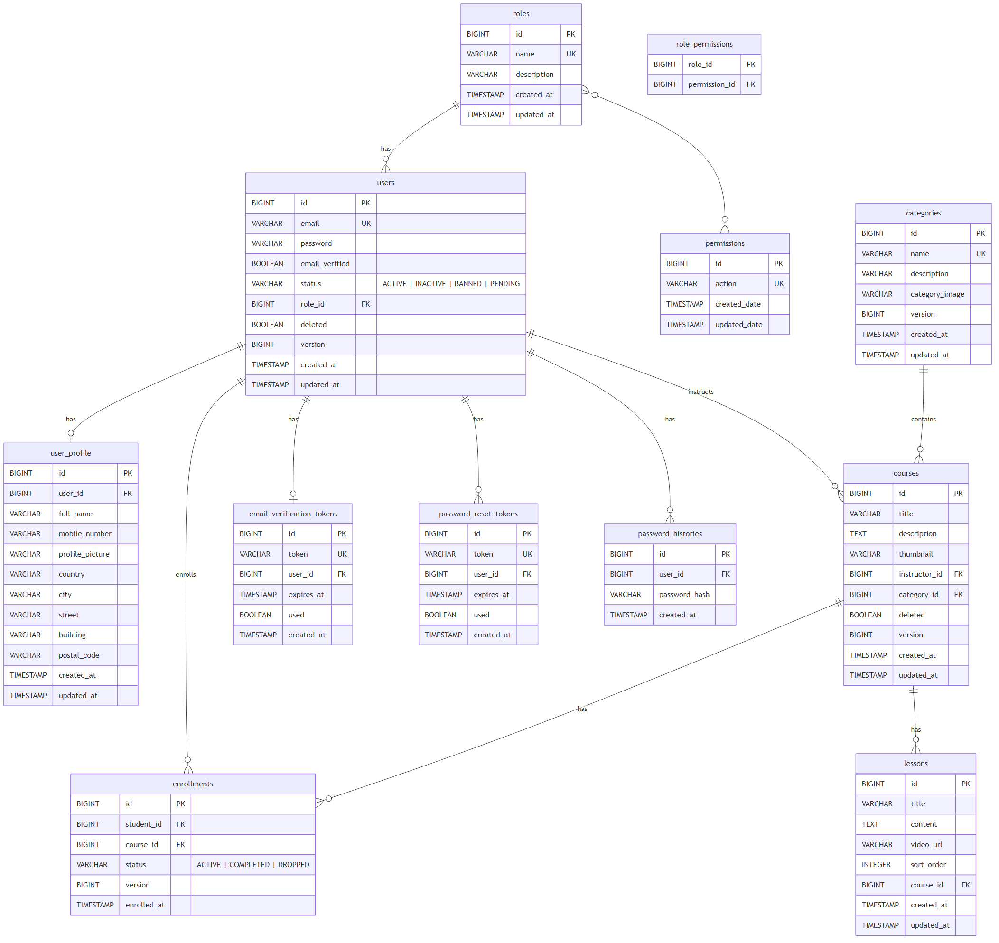

# LearnHub - Entity Relationship Diagram

## Diagram

> Source file: [`erd.mmd`](erd.mmd) — regenerate with `npx @mermaid-js/mermaid-cli --input docs/erd.mmd --output docs/ERD.png --width 2400 --height 1800 --backgroundColor white`

## Relationship Summary

| Relationship | Type | Notes |
|---|---|---|
| `Role` → `User` | One-to-Many | Each user has exactly one role |
| `Role` ↔ `Permission` | Many-to-Many | Via `role_permissions` join table |
| `User` → `UserProfile` | One-to-One | Optional profile with address info |
| `User` → `Course` | One-to-Many | User as instructor |
| `User` → `Enrollment` | One-to-Many | User as student |
| `Category` → `Course` | One-to-Many | Each course belongs to one category |
| `Course` → `Lesson` | One-to-Many | Ordered by `sort_order`; cascade delete |
| `Course` → `Enrollment` | One-to-Many | Unique constraint on `(student_id, course_id)` |
| `User` → `EmailVerificationToken` | One-to-One | Token with expiry |
| `User` → `PasswordResetToken` | One-to-Many | Multiple tokens allowed |
| `User` → `PasswordHistory` | One-to-Many | Prevents password reuse |
